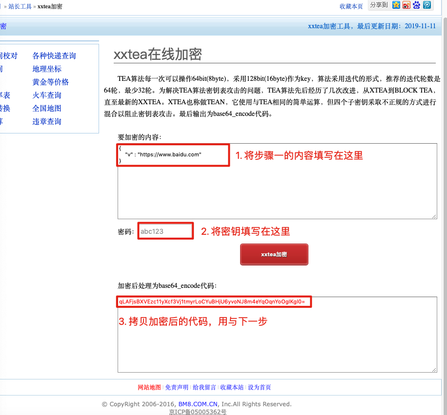

# 使用说明

## 一、填写链接

```json
{
    "v" : "链接地址"
}
```

## 二、加密

把步骤一的内容经过[加密网站](http://tools.bm8.com.cn/xxtea/)加密后，会得到 base64_encode 代码。如：



## 三、组合加密头

把"加密头"和"步骤二"的代按顺序码组合起来（加密头放前面），比如加密头为 [bkengD] ，则组合结果如下： 

```
[bkengD]qLAFjsBXVEzc11yXcf3Vj1tmyrLoCYuBHjU6yvoNJ8m4eYqOqnYoOgIKgl0=
```

## 四、提交

编辑名为 string 的文件，把步骤三的内容覆盖原来的内容。然后提交，就大功告成了。
